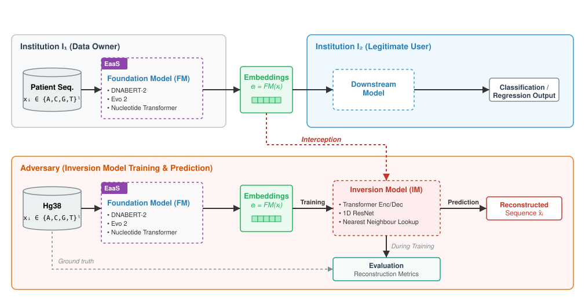

# How Private Are DNA Embeddings? Inverting Foundation Model Representations of Genomic Sequences

> **Authors:** Sofiane Ouaari*, Jules Kreuer* Nico Pfeifer<br>
>  *: Shared first authorship.<br>
>
> Methods in Medical Informatics, Department of Computer Science & Institute for Bioinformatics and Medical Informatics (IBMI)<br>
> University of Tübingen, Germany


<p align="center">
  
</p>

## Abstract

DNA foundation models have become transformative tools in bioinformatics and healthcare applications. Trained on vast genomic datasets, these models can be used to generate sequence embeddings, dense vector representations that capture complex genomic information. These embeddings are increasingly being shared via Embeddings-as-a-Service (EaaS) frameworks to facilitate downstream tasks, while supposedly protecting the privacy of the underlying raw sequences. However, as this practice becomes more prevalent, the security of these representations is being called into question. This study evaluates the resilience of DNA foundation models to model inversion attacks, whereby adversaries attempt to reconstruct sensitive training data from model outputs. In our study, the model's output for reconstructing the DNA sequence is a zero-shot embedding, which is then fed to a decoder. We evaluated the privacy of three DNA foundation models: *DNABERT-2*, *Evo 2*, and Nucleotide Transformer v2 (*NTv2*). Our results show that per-token embeddings allow near-perfect sequence reconstruction across all models. For mean-pooled embeddings, reconstruction quality degrades as sequence length increases, though it remains substantially above random baselines. *Evo 2* and *NTv2* prove to be most vulnerable, especially for shorter sequences with reconstruction similarities > 90%, while *DNABERT-2*'s BPE tokenization provides the greatest resilience. We found that the correlation between embedding similarity and sequence similarity was a key predictor of reconstruction success. Our findings emphasize the urgent need for privacy-aware design in genomic foundation models prior to their widespread deployment in EaaS settings.

## Installation

```bash
pip install -r requirements.txt
```

To generate the Evo 2 embeddings, a separte installation is required.

## Project Structure

```
├── train.py                  # Training script
├── evaluate.py               # Evaluation on hg38
├── evaluate_1000g.py         # Evaluation on 1000 Genomes
├── conf/                     # Hydra configuration files
├── src/
│   ├── data.py               # Data loading and processing
│   ├── train.py              # Training loop
│   ├── evaluate.py           # Evaluation logic
│   ├── tokenizers.py         # Tokenizer wrappers
│   ├── utils.py              # Utility functions
│   ├── plotting_utils.py     # Plotting helpers
│   ├── model/                # Inversion model architectures
│   └── evaluation/           # Evaluation metrics
├── generate/                 # Embedding generation scripts
├── scripts/                  # Data preparation and analysis
├── embedding_analysis/       # Embedding structure analysis
└── tokenizer_ablation/       # Tokenizer ablation experiments
```

## Usage

### 1. Data Preparation and Embedding Generation

Prepare and embedd subsequences from the hg38 reference genome:
```bash
bash prepare_and_generate_all.sh
```

### 2. Training and Evaluation

Train inversion models and evaluate the reconstruction quality:
```bash
bash run_experiments.sh
```

## License

This project is licensed under the [LGPL-2.1 License](LICENSE).

## Acknowledgments

This work was supported by the Carl Zeiss Stiftung Research Project "Certification and Foundations of Safe Machine Learning Systems in Healthcare", by the German Research Foundation (DFG) under Germany's Excellence Strategy—EXC number 2064/1—Project number 390727645, and by the German Federal Ministry of Research, Technology and Space (BMFTR) within the PrivateAIM project (funding number: 01ZZ2316D). The authors thank the International Max Planck Research School for Intelligent Systems (IMPRS-IS).
